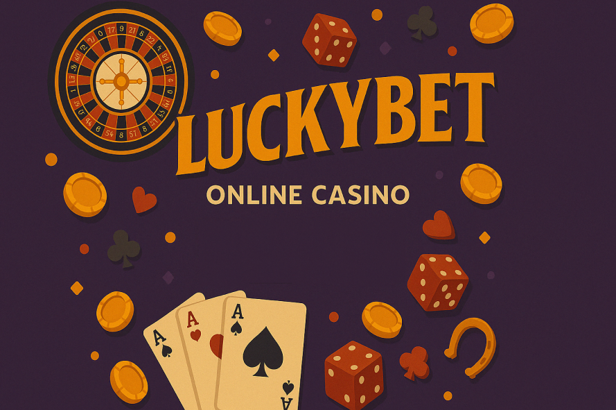
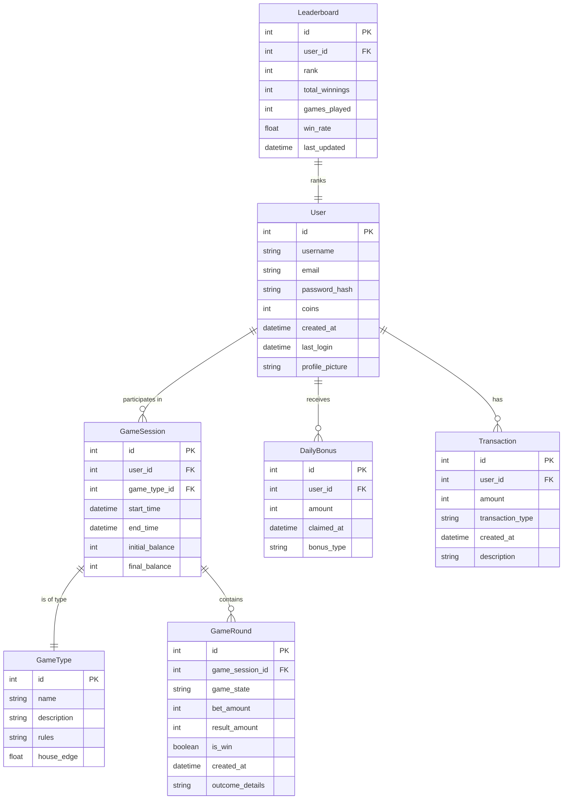
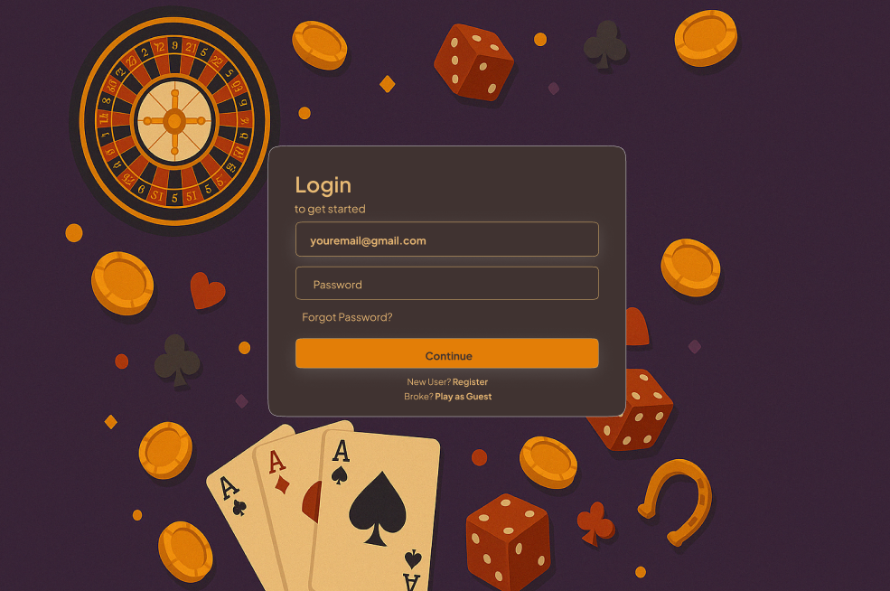
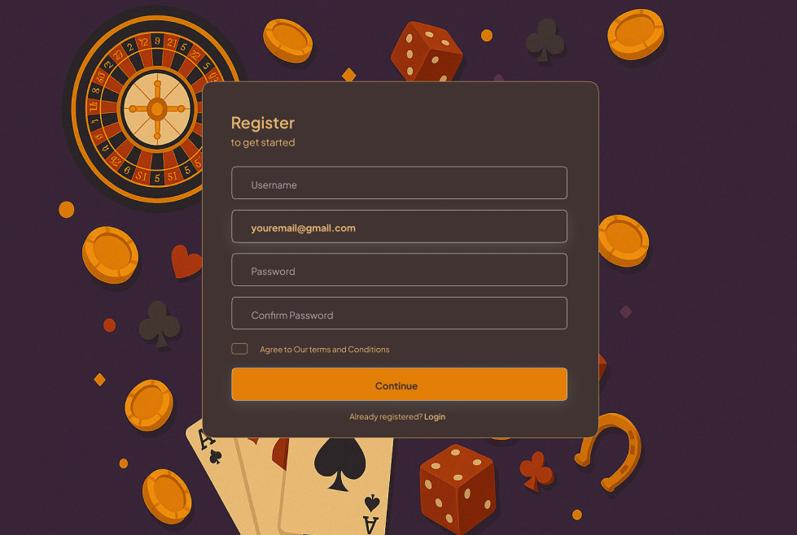
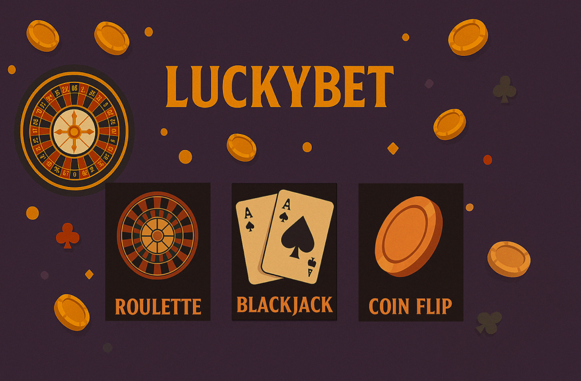
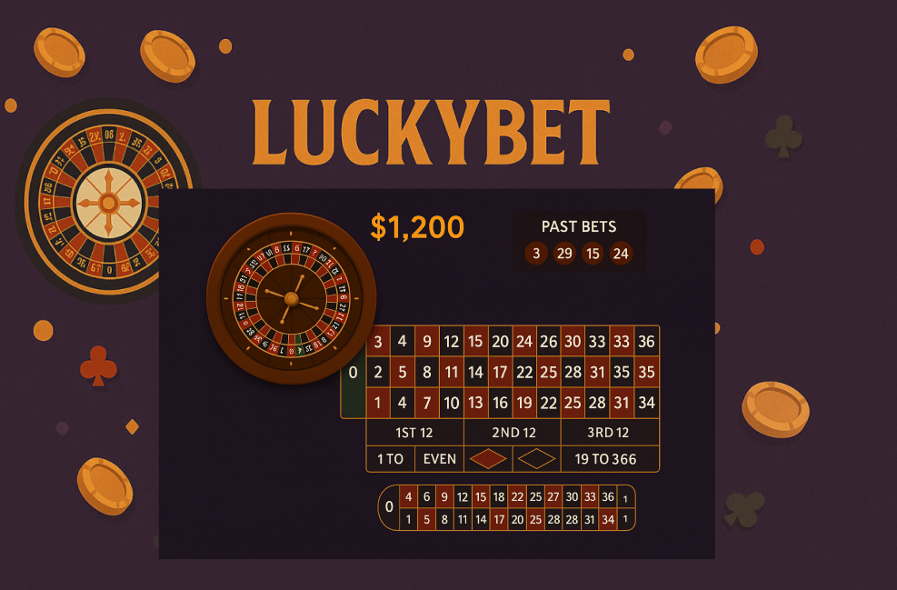
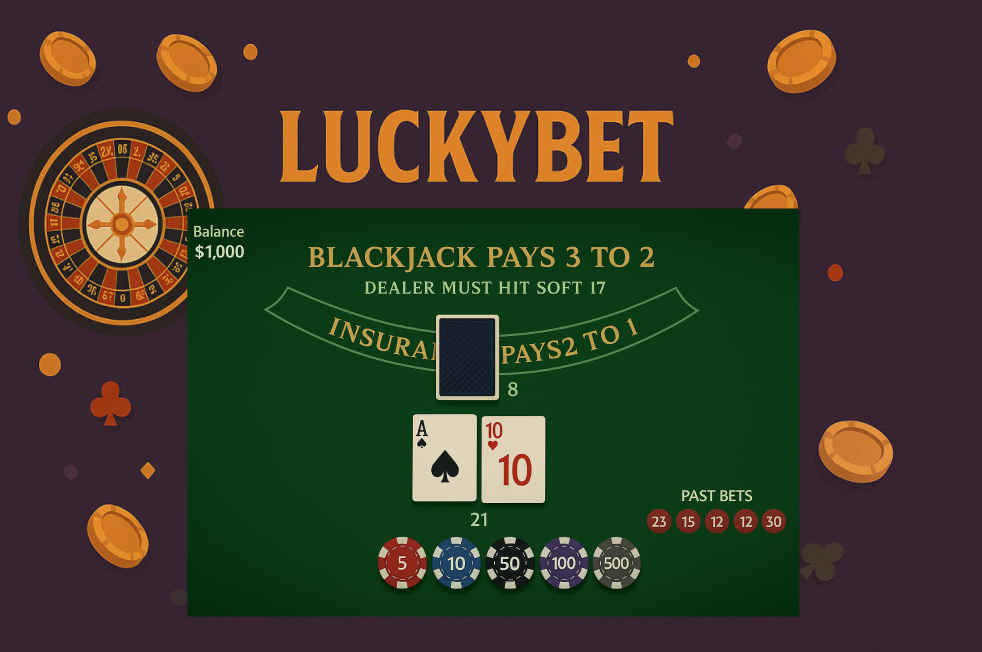

---

Introducing "Taskr" – a collaborative task management platform where teams, families, or study groups can manage shared projects and hold each other accountable. This app is for:

-   Small teams and project groups needing a lightweight way to coordinate tasks.
-   Households or roommates looking to organize shared chores and responsibilities.
-   Students working on group assignments.

Many existing task managers are overly complex for small-scale collaboration or lack features to foster a sense of shared ownership. Taskr aims to bridge the gap, providing the right balance of structure and simplicity for coordination.

## 🧱 Core Functionality

- **User Registration & Login**  
  Users can create an account and log in securely to access game features and track their progress.

- **Game Selection & Play**  
  Users can choose between three games:  
  - **Blackjack** – Classic card game against the house  
  - **Roulette** – Place bets on numbers/colors  
  - **Coin Flip** – Simple double-or-nothing chance game  

- **Virtual Coin Management**  
  - Users start with a default coin balance.  
  - Coin balance is updated after each game.  
  - Daily login bonuses provide additional coins to encourage return visits.

- **Leaderboard**  
  A real-time leaderboard shows the top users based on their current coin balance.

- **Game History Tracking**  
  Users can view their full game history, including game type, win/loss, bet amount, and timestamp.

- **User Profile**  
  Each user has a profile page displaying their stats, total wins/losses, coin balance, and daily streaks.

- **Authentication & Sessions**  
  Session-based login with cookies, including route protection to prevent access without authentication.

- **Error Handling & Feedback**  
  Friendly error messages for invalid logins, insufficient coins, or server issues, with proper HTTP status codes.

- **Testing**  
  - Unit tests for model validation and logic  
  - HTTP tests for game routes and auth  
  - End-to-end tests for full user flows using Playwright

### Requirements

#### User Account Management Stories

-   As a new user, I want to register with a unique username, email, and password so that I can create an account and access the platform.
-   As a returning user, I want to log in using my credentials so that I can continue playing games and manage my coins.
-   As a logged-in user, I want to log out securely so that my session is closed and no one else can access my account.
-   As a user, I want to receive meaningful error messages if I enter incorrect credentials so that I understand what went wrong.

#### Game Play Stories

-   As a logged-in user, I want to play Blackjack against a virtual dealer so that I can try to win coins based on strategy.
-   As a logged-in user, I want to place a bet on Roulette by selecting a number or color so that I can test my luck and potentially win coins.
-   As a logged-in user, I want to flip a virtual coin and bet on heads or tails so that I can have a fast-paced chance-based game.
-   As a controller, I want to validate bets before processing game logic so that invalid input or insufficient coins are handled gracefully.
-   As a user, I want dynamic feedback in the view (win/lose animations, coin balance update) so that my experience feels interactive and responsive.

#### Virtual Currency / Coins Stories

-   As a user, I want to see my current coin balance on my dashboard so that I know how much I can bet.
-   As a user, I want to receive a daily bonus once every 24 hours so that I can keep playing even if I lose all my coins.
-   As a user, I want my coin balance to be updated in real time after every bet so that I stay informed of my financial status.
-   As a model, I want coin transactions (wins/losses/bonuses) to be tracked and related to users so that a clear coin history is maintained.
-   As a user, I want to receive a notification if I try to bet more coins than I currently have so that I understand the betting limits.

#### User Profile Management Stories

-   As a user, I want to access a profile page showing my coin balance, game history, and daily streaks so that I can track my activity.
-   As a user, I want to view my login history so that I feel secure and aware of account access.
-   As a user, I want to delete my account and associated data so that I have control over my presence on the site.

#### Game History Tracking Stories

-   As a user, I want to view a detailed history of my past games including date, game type, bet amount, and result so that I can analyze my performance.
-   As a user, I want to filter my game history by game type (e.g., only Blackjack) so that I can focus on specific trends.
-   As a user, I want the game history interface to be clear and visually appealing so that I can easily interpret the data.

## ᛦ Entity Relationships

>[!note]
> If you view the source code for this README file, you'll see the Mermaid syntax that generated the following diagram. You can copy the code into the [live Mermaid editor](https://mermaid.live) to play around and make changes specific to your app.

## ⚙️ System Architecture Responsibilities

- **Authentication System**  
  Handles user registration, login, logout, and session management using cookies and server-side validation.

- **Game Management**  
  Core logic for game interactions including starting a new game session, processing outcomes, updating virtual coin balances, and recording results in history.

- **Coin & Leaderboard Logic**  
  Manages coin transactions (bets, winnings, losses, daily bonuses), and leaderboard updates based on user balances.

- **UI Elements**  
  Includes design and implementation of user-facing views such as:
  - Registration and login forms  
  - Game selection menu and individual game interfaces  
  - Coin balance display  
  - Leaderboard and user profile pages  
  - Game history log
## 📍 API Routes

> **Note**  
> For now these are the APIs.

| Request           | Action                          | Response        | Description                                                        |
|------------------|----------------------------------|-----------------|--------------------------------------------------------------------|
| `POST /register` | `authController.register()`      | 302 Redirect    | Registers a new user and redirects to the login page               |
| `POST /login`    | `authController.login()`         | 302 Redirect    | Logs the user in and starts a session                              |
| `GET /logout`    | `authController.logout()`        | 302 Redirect    | Logs the user out and clears the session                           |
| `GET /games`     | `gameController.index()`         | 200 View        | Renders the game selection page                                    |
| `POST /play/blackjack` | `gameController.playBlackjack()` | 200 JSON/View   | Starts a Blackjack round using an external API for cards           |
| `POST /play/roulette`  | `gameController.playRoulette()`  | 200 JSON/View   | Simulates a Roulette spin and returns result                       |
| `POST /play/coinflip`  | `gameController.playCoinFlip()`  | 200 JSON/View   | Flips a virtual coin and returns heads or tails                    |
| `POST /bonus`    | `coinController.dailyBonus()`    | 200 JSON/View   | Grants a daily login bonus to the user’s coin balance              |
| `GET /profile`   | `userController.profile()`       | 200 View        | Shows user profile, coin balance, and game history                 |
| `GET /leaderboard`| `leaderboardController.index()` | 200 View        | Displays top players ranked by coin balance                        |

> 🎴 **External API Use:**  
> The Blackjack game will integrate with an external API (e.g., `https://deckofcardsapi.com`) to draw and shuffle real-time card decks for a more dynamic and authentic game experience.

### 🎮 Game Management

| Request                 | Action                              | Response               | Description                                                      |
|-------------------------|-------------------------------------|------------------------|------------------------------------------------------------------|
| POST /games/blackjack   | GameController::playBlackjack       | 200 JSON / View        | Play a round of Blackjack using external deck API               |
| POST /games/roulette    | GameController::playRoulette        | 200 JSON / View        | Spin the Roulette wheel and resolve the bet                     |
| POST /games/coinflip    | GameController::playCoinFlip        | 200 JSON / View        | Flip a virtual coin and return heads or tails                   |
| GET /games/history      | GameController::getGameHistory      | 200 GameHistoryView    | Display a user’s past plays, wins/losses, and timestamps        |
| GET /games/leaderboard  | LeaderboardController::getTopUsers  | 200 LeaderboardView    | Show the top users sorted by coin balance                       |

### 💰 Coin & Bonus Management

| Request         | Action                               | Response             | Description                                      |
|-----------------|----------------------------------------|----------------------|--------------------------------------------------|
| POST /bonus      | CoinController::claimDailyBonus        | 200 JSON             | Give the user a one-time daily bonus             |
| GET /coins       | CoinController::getUserBalance         | 200 JSON / View      | Fetch the current coin balance for a user        |
| POST /coins/spend| CoinController::spendCoins             | 200 JSON             | Deduct coins from the user for a bet             |
| POST /coins/add  | CoinController::addCoins               | 200 JSON             | Add coins to the user account after a win        |

### 👤 User Profile & Auth

| Request          | Action                              | Response           | Description                                               |
|------------------|-------------------------------------|--------------------|-----------------------------------------------------------|
| POST /register    | AuthController::registerUser        | 302 Redirect        | Register a new user and redirect to login                 |
| POST /login       | AuthController::loginUser           | 302 Redirect        | Log the user in and start a session                       |
| GET /logout       | AuthController::logoutUser          | 302 Redirect        | End the session and log the user out                      |
| GET /profile      | UserController::getProfile          | 200 ProfileView     | View the user’s profile including coins and play history  |

## 📐 Wireframes

>[!note]
> Don't go crazy detailed with the wireframes! These should be minimal sketches to convey to the customer what the app will roughly look like. These things tend to change over time as requirements evolve, but you need to start from somewhere.

The login view is the initial screen where users can enter their credentials to log into their account. It typically consists of a form with input fields for the username/email and password, along with a "Login" button. The login view should also include a link to the registration page for new users who don't have an account yet.

The register view allows new users to create an account by providing information such as their email, username, and password. Once registered, the user can be redirected back to the login page to sign in and start playing.

After logging in, the user is brought to the game selection view. Here, they can choose between three available games: Roulette, Blackjack, or Coin Flip. Each option is presented as a clickable card or button that will take the user to the corresponding game window.

Once a game is selected, a dedicated window opens for that game. Each game window (Roulette, Blackjack, or Coin Flip) displays its specific layout and features. The user can play the game, place bets, and interact with the game elements within this window.